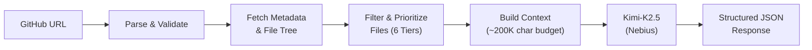

# GitHub Repository Summarizer API

**AI Performance Engineering Course 2026 — Admission Assignment**  
*(See [docs/ADMISSION_TASK.md](./docs/ADMISSION_TASK.md) for the original task requirements and evaluation criteria from Nebius Academy).*

A FastAPI service that takes a public GitHub repository URL and returns a structured, LLM-generated summary of what the project does, its technologies, and how it's organized.

## Quick Start

### Prerequisites

- **Python 3.10+** (tested with 3.12)
- **Nebius Token Factory API key** — [sign up here](https://tokenfactory.nebius.com/) (free $1 credit)

### Setup

**1. Clone the repository**

```bash
git clone https://github.com/Ashish-Soni08/ai-perf-eng-2026.git
cd ai-perf-eng-2026
```

**2. Setup environment (macOS/Linux)**

```bash
python -m venv .venv
source .venv/bin/activate
pip install -r requirements.txt
export NEBIUS_API_KEY="your-api-key-here"
```

**3. Setup environment (Windows)**

```powershell
python -m venv .venv
.venv\Scripts\activate
pip install -r requirements.txt
$env:NEBIUS_API_KEY="your-api-key-here"
```

*(Optional: You can also just create a `.env` file in the root directory with `NEBIUS_API_KEY=your-api-key-here` instead of exporting it).*

**4. Start the server**

```bash
uvicorn app.main:app --host 0.0.0.0 --port 8000
```

### Test It

**Health check** (Returns `{"status": "ok"}`)

```bash
curl http://localhost:8000/health
```

**Summarize a repository** (Takes ~10-20s depending on repo size)

```bash
curl -X POST http://localhost:8000/summarize \
  -H "Content-Type: application/json" \
  -d '{"github_url": "https://github.com/psf/requests"}'
```

The interactive API docs are available at [http://localhost:8000/docs](http://localhost:8000/docs).

---

## API Reference

### `GET /health`

Returns `{"status": "ok"}` if the server is running.

### `POST /summarize`

**Request:**

```json
{
  "github_url": "https://github.com/vercel-labs/json-render"
}
```

**Success Response (200):** *(real example from our API)*

```json
{
  "summary": "json-render is a Generative UI framework that enables AI to generate dynamic, type-safe user interfaces from natural language prompts. It constrains AI output to predefined component catalogs using Zod schemas and renders JSON specs across multiple platforms including React (web), React Native (mobile), PDF documents, and video compositions via Remotion. The framework supports streaming responses for progressive UI rendering and includes 36 pre-built shadcn/ui components for rapid development.",
  "technologies": [
    "TypeScript",
    "React",
    "Next.js",
    "Zod",
    "Tailwind CSS",
    "Radix UI",
    "Vercel AI SDK",
    "Remotion",
    "React PDF",
    "Expo",
    "Drizzle ORM",
    "Stripe SDK",
    "pnpm",
    "Turbo"
  ],
  "structure": "The repository is organized as a monorepo with packages/ containing the core framework (@json-render/core) and platform-specific renderers (react, react-native, react-pdf, remotion, shadcn, codegen), apps/web housing the Next.js documentation site with MDX content, and examples/ providing reference implementations including chat interfaces, dashboards, Stripe apps, mobile applications, and PDF generation demos.",
  "repo_metadata": {
    "name": "json-render",
    "owner": "vercel-labs",
    "url": "https://github.com/vercel-labs/json-render",
    "stars": 11123,
    "language": "TypeScript",
    "default_branch": "main"
  }
}
```

**Error Response:**

```json
{
  "status": "error",
  "message": "Description of what went wrong"
}
```

| Status | When |
|--------|------|
| 422 | Invalid or missing `github_url` |
| 404 | Repository not found or private |
| 429 | GitHub API rate limit exceeded |
| 500 | Server configuration error |
| 502 | LLM service error |
| 504 | Timeout (GitHub or LLM) |

---

## How It Works



1. **Parse** the GitHub URL → extract `owner/repo`
2. **Fetch** repository metadata (stars, language, topics) and recursive file tree via GitHub API
3. **Filter** out noise (binaries, lock files, `node_modules/`) and rank files into 6 priority tiers
4. **Build** a context string within a ~200K character budget: metadata → directory tree → file contents in priority order
5. **Send** to Kimi-K2.5 with a system prompt enforcing strict JSON output
6. **Return** the structured response enriched with repo metadata

---

## Design Decisions

### Model Choice

**Model:** [`moonshotai/Kimi-K2.5`](https://tokenfactory.nebius.com/) via Nebius Token Factory (eu-west1)

| Spec | Value |
|------|-------|
| Context window | 256K tokens |
| Quantization | INT4 |
| Speed | ~60 tok/s |
| Pricing | $0.50/M input · $2.50/M output |
| License | MIT |
| Capabilities | Text-to-text, tool calling, reasoning |

**Why this model?**

- **256K context** — handles even large repositories without truncation
- **Reasoning model** — uses chain-of-thought for better analysis
- **Strong instruction following** — reliably outputs structured JSON
- **Cost-effective** — well within the $1 free Nebius credit budget
- **MIT licensed** — fully open-source (built on ~15T mixed visual & text tokens)

> **Note:** Kimi-K2.5 is a reasoning model. The API returns both `reasoning_content` (chain-of-thought) and `content` (final answer). The app handles both fields automatically, with `max_tokens=8192` to give the model headroom for thinking + structured JSON output.

### Why FastAPI?

- **Async-native** — ideal for I/O-heavy workloads (concurrent GitHub API calls + LLM inference)
- **Built-in Pydantic validation** — request/response schemas with automatic error messages
- **Auto-generated OpenAPI docs** — interactive API explorer at `/docs` with zero extra code

### Repository Content Processing

The core challenge is fitting the most informative parts of a repository into the LLM's context window. Here's the approach:

**1. Skip irrelevant files** — Binary files (images, fonts, compiled code), lock files (`package-lock.json`, `poetry.lock`), generated directories (`node_modules/`, `dist/`, `__pycache__/`), and IDE configs are never fetched.

**2. Tiered file prioritization** — Files are ranked by information value:

| Priority | What | Why |
|----------|------|-----|
| Tier 1 | `README.md` | Best project overview |
| Tier 2 | Package manifests (`package.json`, `pyproject.toml`, etc.) | Technologies & dependencies |
| Tier 3 | Config files (`Dockerfile`, `Makefile`, `tsconfig.json`) | Architecture & tooling |
| Tier 4 | Entry points (`main.py`, `app.js`, `index.ts`) | Core logic |
| Tier 5 | Other source files | Additional context |
| Tier 6 | Supplementary docs (`CONTRIBUTING.md`, `LICENSE`) | Low priority |

**3. Token budgeting** — A ~200K character budget is allocated. High-priority files are always included (truncated if needed), lower-priority files fill the remaining budget. If the budget runs out, remaining files are omitted with a count.

**4. Structured context** — The final context string sent to the LLM looks like this:

```
=== REPOSITORY METADATA ===
Name: json-render
Description: From JSON to UI
Language: TypeScript
Topics: react, ai, generative-ui

=== DIRECTORY STRUCTURE ===
packages/
  core/
  react/
  ...
apps/
  web/

=== FILE CONTENTS ===
--- README.md ---
(file content here)

--- package.json ---
(file content here)
...
```

This strategy ensures the LLM gets the most important information first, even for repositories with thousands of files.

---

## Running Tests

```bash
# Install test dependencies
pip install pytest

# Run all tests
pytest tests/ -v

# Run without network-dependent tests
pytest tests/ -v -k "not nonexistent_repo"
```

The test suite includes **69 tests** covering:

- URL parsing (12 cases)
- Content filtering — skip rules, tier assignment, file selection
- LLM response parsing and validation
- Pydantic model validation
- API endpoints via FastAPI TestClient

---

## Project Structure

```
ai-perf-eng-2026/
├── app/
│   ├── __init__.py
│   ├── main.py            # FastAPI app, CORS, endpoints, error handlers
│   ├── models.py           # Pydantic request/response schemas
│   ├── config.py           # Configuration from environment variables
│   ├── github_fetcher.py   # GitHub API interaction
│   ├── content_filter.py   # File filtering & context building
│   └── llm_client.py       # Nebius Token Factory LLM integration
├── tests/
│   ├── __init__.py
│   └── test_app.py         # Comprehensive test suite
├── requirements.txt
└── README.md
```

---

## Environment Variables

| Variable | Required | Description |
|----------|----------|-------------|
| `NEBIUS_API_KEY` | Yes | Your Nebius Token Factory API key |
| `GITHUB_TOKEN` | No | GitHub personal access token (increases rate limit from 60 to 5000 req/hr) |

---

### Built With 🚀

> **Antigravity & Claude 3.7 Sonnet (Thinking Mode)**
>
> *Image Prompt Idea:* A futuristic, sleek glowing orb representing the 'Antigravity' agent seamlessly merging with a deep neural network visualization representing Claude's advanced 'thinking mode', rendered in dark mode with cyan and purple neon accents, conveying high-speed AI engineering collaboration.
>
> — **Ashish Soni**
